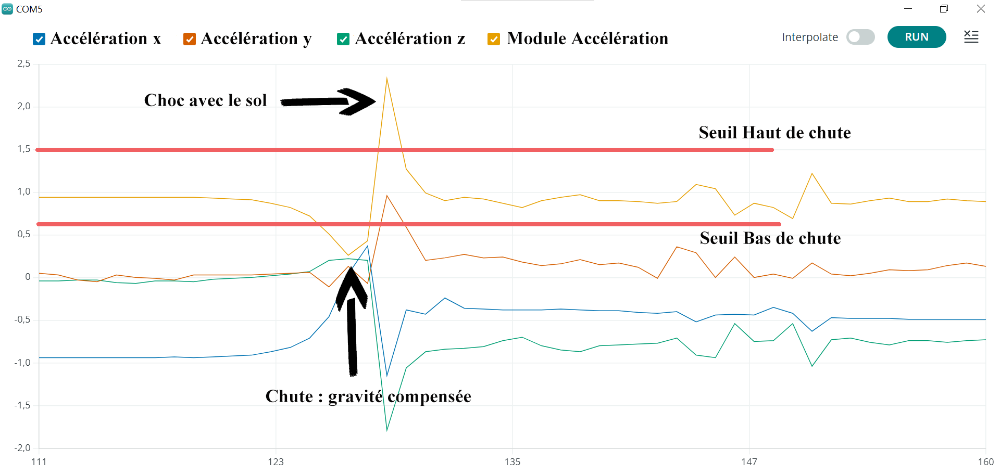
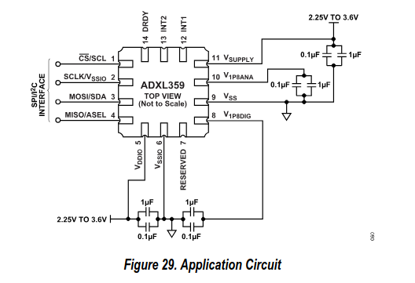

# Détecteur de chute

Nous souhaitons développer un capteur de chute, à l'aide d'un axéléromètre 3 Axes.
Lorsqu'une chute est détectée : 
- Une alerte via un vibreur est transmise à l'utilisateur.
- Il dispose de 10 secondes pour confirmer qu'il ne s'est pas évanoui via un bouton.
- Si il a confirmé qu'il était conscient, rien ne se passe.
- En revanche, si il n'a rien confirmé alors une alerte est envoyé par bluetooth sur le téléphone.


## Planning et Deadlines

- 04 Octobre 2024 : Choix du système visé (Remettre une page décrivant le système
imaginé, les mesures qui seront faites + toute autre info pertinente) \
Le [lien](https://docs.google.com/document/d/1k7mpjtoi8ii_IY9sKmL_kZ1YLawBmLwHGLVDXy7D6bw/edit?usp=sharing) vers le document
- 17 Octobre 2024 : Commande de composants 
- 24 Octobre 2024 : Evaluation intermédiaire
- 29 Novembre 2024 : Présentation orale
- 06 Décembre 2023 : Rendu du rapport final écrit 


## Critères pour les profs

L'idée est de faire une première application avec un module compatible Arduino. 
Puis de faire une autre version où on part du composant seul (ou package) et de faire un PCB autour du composant.

A la fin, il faudra comparer les deux.\
Dans notre cas, il s'agit d'un tout ou rien : détection ou non détection. \
Mais nous pouvons récupérer les valeurs des accélérations des 2 capteurs et comparer leurs valeurs.\
De plus nous pouvons réaliser un test statistique sur la détection de chute. (exemple en dessous)

| Cas réel -> | Statique | Chute | Marche |
|-------------|:--------:|:-----:|:------:|
| Statique    |   99%    |  1%   |   0%   |
| Chute       |   1.5%   |  98%  |  0.5%  |
| Marche      |    5%    |  25%  |  70%   |


Et aussi pour la comparaison des 2 capteurs

|                | Capteur1 | Capteur2 |
|----------------|:--------:|:--------:|
| Statique       |   99%    |   99%    |
| Marche         |   97%    |   98%    |
| Chute droite   |   80%    |   98%    |
| Chute en avant |   95%    |   95%    |

Et ainsi comparer nos 2 capteurs.\
Certes nous n'avons que des valeurs tout ou rien mais nous pouvons dire par plusieurs paramètres si un capteur est mieux qu'un autre.


### Réalisation de tests

Il va falloir pouvoir réaliser des tests qui sont reproductibles !\
Il faut pouvoir obtenir le même résultat en faisant une même manip plusieurs fois.


- Test de la chute droite : 
    - Récupération des valeurs lorsqu'un humain chute, pour avoir une idée de modèle.
    - On peut modéliser cette chute avec un ballon qui tombe sur un matelas en mousse par exemple. Ceci permettra une certaine reproductibilité.
- Test de la chute en avant : 
    - Pareil, récupération des valeurs pour un humain
    - Modélisation par exemple par un balai qui tombe en avant.


**Notes sur les chutes :**
- Faire attention à l'orientation du capteur, son positionnement sur le témoin
- Pouvoir reproduire la chute en toutes conditions


# Capteur de chute V1

On utilise le code ```CapteurChuteV1.ino```

Lorsqu'une chute se passe voici ce que nous pouvons mesurer : 



Lorsque le module passe en dessous du seuil bas, c'est le début de la chute : la gravité est compensée par la chute.\
Puis on repasse au dessus du seuil haut, c'est lorsqu'on heurte le sol : gravité + impact avec le sol.


Badé sur ce modèle, nous créons le code arduino ```CapteurChuteV1.ino```, qui utilise un diagramme d'état. \
Voici son schéma : 


# Le nouveau capteur

Nous rédigeons un tableau comparatif entre les 2 capteurs : 

|                      |      ADXL 345       |      ADXL 359      |
|----------------------|:-------------------:|:------------------:|
| Interface            |      SPI, I²C       |      SPI, I²C      |
| Technologie utilisée |        MEMS         |        MEMS        |
| Plage de mesure      | ±2g, ±4g, ±8g, ±16g |  ±10g, ±20g, ±40g  |
| Résolution           |       13 bits       |      20 bits       |
| Bruit                |     380 µg/√Hz      |     80 µg/√Hz      |
| 0g Offset            |        ±150 mg      |       ±125 mg      |
| Taille du boîtier    | 3 mm × 5 mm × 1 mm  | 4 mm × 4 mm × 1 mm |


**La technologie MEMS (Micro-Electro-Mechanical Systems).**\
 Un dispositif MEMS est composé de minuscules éléments comme des ressorts, des leviers et des masses mobiles  qui sont gravés sur du silicium.\
 Lorsqu'une force externe (comme une accélération) agit sur ces éléments, cela provoque un mouvement des masses et viens déformer les ressorts. Ce mouvement viens changer la valeur de capacité, ce qui vient influer sur le signal électrique, nous récupérons ainsi des informations sur l'accélération.

Voici le schéma de l'ADXL 359.



| Pin N° | Mnemonic |                                                                                            Description                                                                                            |
|--------|:--------:|:-------------------------------------------------------------------------------------------------------------------------------------------------------------------------------------------------:|
| 1      |   SCL    |                                                                             Serial Communications Clock for I2C (SCL)                                                                             |
| 2      |  Vssio   |                                                                           Connected to Pin 6 (VSSIO) to enable I2C mode                                                                           |
| 3      |   SDA    |                                                                                    Serial Data for I2C (SDA).                                                                                     |
| 4      |   ASEL   |                                                                           Alternate I2C Address Select for I2C (ASEL).                                                                            |
| 5      |  Vddio   |                                                                                 Digital Interface Supply Voltage                                                                                  |
| 6      |  Vssio   |                                                                                          Digital Ground                                                                                           |
| 7      | RESERVED |                                                                    Reserved. This pin can be connected to ground or left open.                                                                    |
| 8      | V1P8DIG  |                                 Digital Supply. This pin requires a decoupling capacitor. If VSUPPLY connects to VSS, supply the voltage to this pin externally.                                  |
| 9      |   Vss    |                                                                                           Analog Ground                                                                                           |
| 10     | V1P8ANA  |                                  Analog Supply. This pin requires a decoupling capacitor. If VSUPPLY connects to VSS, supply the voltage to this pin externally.                                  |
| 11     | VSUPPLY  | Supply Voltage. When VSUPPLY equals 2.25 V to 3.6 V, VSUPPLY enables the internal LDO regulators to generate V1P8DIG and V1P8ANA. For VSUPPLY = VSS, V1P8DIG and V1P8ANA are externally supplied. |
| 12     |   INT1   |                                                                                          Interrupt Pin 1                                                                                          |
| 13     |   INT2   |                                                                                          Interrupt Pin 2                                                                                          |
| 14     |   DRDY   |                                                                                          Data Ready Pin.                                                                                          |
